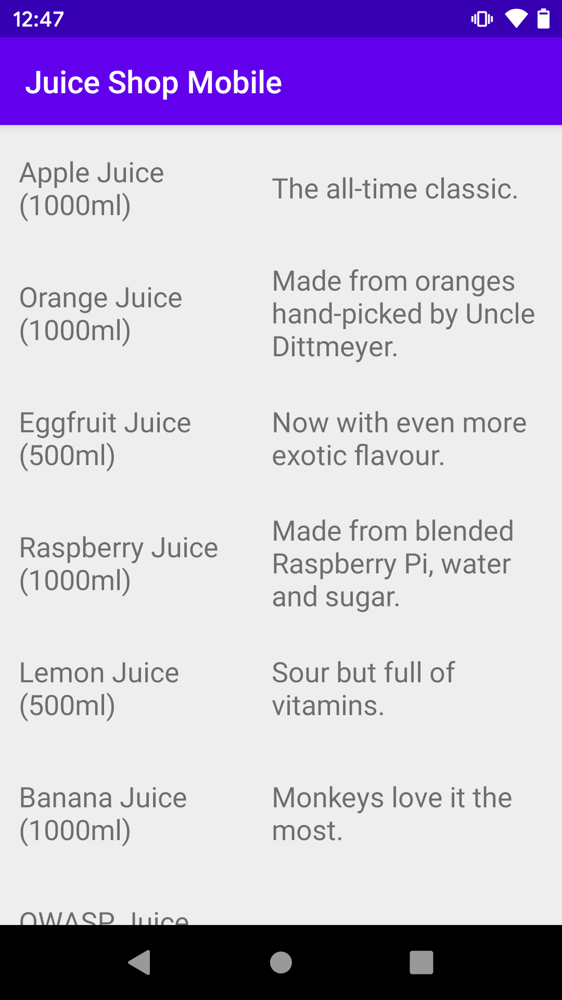

# Juice Shop Mobile
📱 Probably the most insecure Android App (based on OWASP Juice Shop's API)

## Setup

1. Install and start the OWASP Juice Shop server

```
git clone https://github.com/bkimminich/juice-shop.git
cd juice-shop
npm install
npm start
```

2. Clone this repository

```
git clone https://github.com/abhaynayar/juice-shop-mobile.git
```

3. Open its directory as a project through Android Studio (or any Android compatible IDE of your choice).
4. Run the project on an emulated device. (If you want to use a physical device, you need to change the IP address in the source code)

## Status

For now, there is a product listing in the app that is being fetched from `/api/Products`.



## To-do

- [ ] Add option to choose server IP and port.
- [ ] Replicate "Hidden Score Board" and "Administration Section" by exporting hidden activities.
- [ ] Use CardView for the list, and follow OWASP Juice Shop design patterns.
- [ ] Look into Authentication mechanisms for the API.
- [ ] Look into creating XSS challenges through WebViews.

